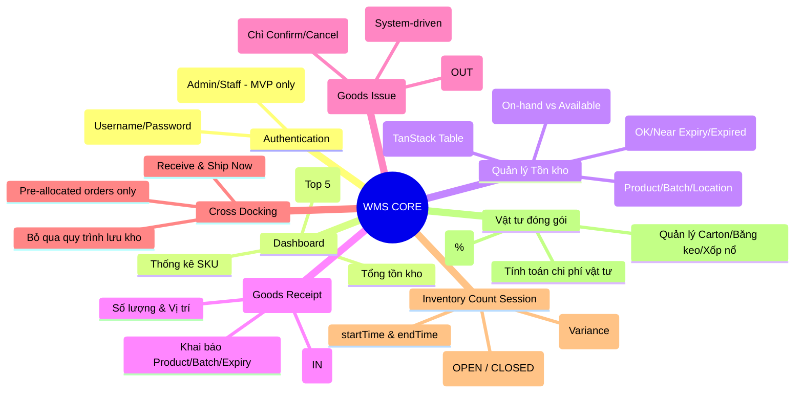

# WMS Core - Wireframe & Feature Map

Tài liệu này mô tả sơ đồ cấu trúc (Wireframe) và bản đồ tính năng (Feature Map) của hệ thống Quản lý kho nội bộ (WMS Core).

---

## 🗺️ 1. Feature Map (Bản đồ tính năng)

Dưới đây là sơ đồ phân cấp các tính năng chính của hệ thống.



---

## 🖼️ 2. Wireframe Structure (Sơ đồ bố cục)

Hệ thống sử dụng bố cục **Sidebar (Trái)** và **Content (Phải)** để tối ưu hóa việc điều hướng nhanh.

### 2.1. Main Layout
```text
+-----------------------------------------------------------------------+
| Header: [Menu Toggle] [Module Title]            [Admin User | Kho HCM]|
+----------+------------------------------------------------------------+
| Sidebar  | Main Content Area                                          |
|          |                                                            |
| Dashboard|  [Module Header] [Action Buttons]                          |
| Inventory|                                                            |
| Receipt  |  +------------------------------------------------------+  |
| Issue    |  |                                                      |  |
| CrossDock|  |                                                      |  |
| Count    |  |               DATA TABLE / FORM                      |  |
| Packaging|  |                                                      |  |
|          |  |                                                      |  |
| [Logout] |  +------------------------------------------------------+  |
+----------+------------------------------------------------------------+
```

---

## 🏗️ 3. Wireframe chi tiết từng Module

### 3.1. Dashboard (Tối giản)
- **Top**: 3 Thẻ chỉ số (SKU, Tổng tồn, Cảnh báo đỏ).
- **Middle**: Bảng "Top 5 Near Expiry" (Hiển thị Name, Batch, Expiry, Qty).

### 3.2. Inventory (Quản lý tồn kho)
- **Header**: Thanh Search đa năng (Product/Batch/Sku).
- **Table**: 
  - `Product | Batch | Expiry | Qty (On-hand) | Qty (Available) | Location | Status`

### 3.3. Goods Issue (FEFO Flow) - System Driven
- **Cột Trái (30%)**: Ô nhập Product + Số lượng yêu cầu + Nút "Suggest Batch".
- **Cột Phải (70%)**: 
  - Danh sách Batch đề xuất (Auto-sorted by Expiry).
  - **Khóa chỉnh sửa**: User KHÔNG được sửa số lượng/thứ tự Batch.
  - Nút "XÁC NHẬN XUẤT KHO" / "HỦY PHIẾU".

### 3.4. Inventory Count Session (Control Flow)
- **Giai đoạn 1**: Tạo Session (OPEN) ->startTime ghi nhận.
- **Giai đoạn 2**: Nhập số liệu thực tế -> Status: COUNTING.
- **Giai đoạn 3**: Đóng Session (CLOSED) ->endTime ghi nhận -> Hiển thị "Variance" & Badge (Khớp/Lệch).

---

## 🛠️ 4. Quy trình nghiệp vụ chính (Workflow)

### 📥 Nhập hàng (Receipt)
`User khai báo -> System tạo StockMovement -> Update Inventory Qty`

### 📤 Xuất hàng (Issue - FEFO)
`User yêu cầu số lượng -> System quét Expiry Date sớm nhất -> Gợi ý n Batch -> User xác nhận -> Trừ Inventory`

### 📦 Cross-docking
`User nhập OrderID -> System liệt kê items -> User click Receive & Ship -> System ghi nhận IN/OUT cùng lúc`

---
*Tài liệu này được tạo dựa trên kiến trúc thực tế của dự án.*
